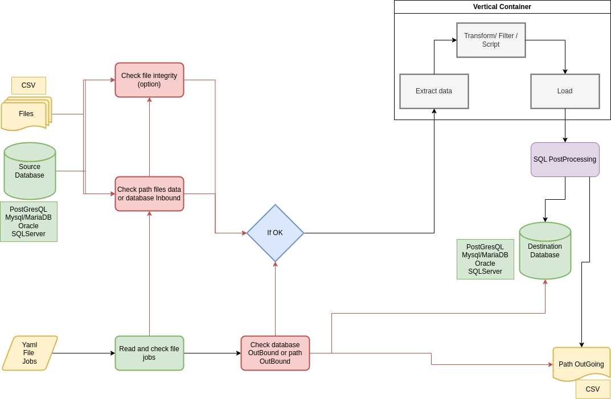

# isiETL

**_A free, open source, lightweight extract, transform, and load (ETL) tool that offers a low memory and CPU footprint while remaining fast.  
 🔧️ It's perfect and very useful for small extraction and integration jobs requiring a solid base that's quick to set up via a simple script describing the ‘job’._**

**License**  
GPLV3
[License GPLV3](https://www.gnu.org/licenses/gpl-3.0.fr.html#license-text)  

see: [Local license Markdown file LICENSE.md ...](./LICENSE.md)  
<br> 

**Author**  
TONDEUR Hervé (ISIHOP - Lab Open Source)
[https://github.com/isi-hop](https://github.com/isi-hop)   

**Description**  

**🇺🇲️ ENGLISH**  
    This package is a Java program with a low memory footprint, intended to be used as a small data integrator, 
    more commonly known as an ETL (Extract Transform Load) tool, which can be useful for setting up 
    a lightweight ETL project. Its objective is to be as simple as possible to configure and to retain the 
    power of a quality ETL service for the relational database ecosystem.
    Its ambition in this area is to be as complete as possible. 
        
**🇫🇷️ FRANCAIS**  
    Ce package est un programme Java à faible empreinte mémoire, destiné a être utilisé comme un petit intégrateur 
    de données, plus communément appelé outil ETL (Extract Transform Load), celui ci peut être utile pour mettre 
    en place un projet léger ETL. Son objectif est d'être aussi simple que possible à paramétrer et de conserver 
    la puissance d'un service ETL de qualité pour l'écosystème de bases de données relationnelles.
    Il a pour ambition dans ce domaine d'être le plus complet possible.  

## Construct a job  

### General informations    

**What can we do ?**  

 IsiETL is based on reading a job description file. This description file must be written in YAML format and given any name you like (note that the default name for this file is integrator.yml if you want it to be automatically found by the current Job Runner).  
You must therefore start by building a job file in Yaml. To do this, you can use IsiETL and its option (`-jt` / `--jobstemplate`),this option allows you to generate a template file in your application's local folder for running an IsiETL job. All you have to do is fill it in correctly with values ​​representing your file and database elements.  

*What can we do with IsiETl?*  

- Extract data from a database and save it to a file (CSV format for now).  
- Securely import data from a file into a database (Postgresql for now).  
- Check the file format and consistency before integration (to minimize error-related shutdowns during integration).  
- Enable controlled integration by avoiding duplicates.  
- Conversely, you can also integrate your data without duplicate checks.  
- Control integration via batch mode into your database, which speeds up integration times.  
- Have control, automatically and securely create the dump table schema in your database.  
- Execute pre- and post-integration actions.  
- Filtering action, which allows you to not integrate data if it does not match a set of filter criteria.  
- Mapping action, allowing you to mix and concatenate your input data to the output.  
- Transformation action, allowing you to transform your values ​​before integration.  
- Post-processing action, allowing you to run queries on the table after integration is complete (raw SQL is supported and allows DML actions (INSERT, UPDATE, DELETE).  

😃️ _You will find on this diagram below the sequencing of the flows of the IsiETL application._  

  

✍️ Under Construction    

### Create a job file  

Ideally, to create a job, you should use a template file dedicated to this activity and with the variable names correctly predefined.  

You can obtain this template file by running IsiETL with the `-jt` option or the long `--jobtemplate` option. This dumps a YAML-formatted template file named `integrator_template.yml` into your program's local folder.  

_Below is what the template file contains_  

``` YAML    
# Copyright (C) 2025 tondeur-h
#
# This program is free software: you can redistribute it and/or modify
# it under the terms of the GNU General Public License as published by
# the Free Software Foundation, either version 3 of the License, or
# (at your option) any later version.
#
# This program is distributed in the hope that it will be useful,
# but WITHOUT ANY WARRANTY; without even the implied warranty of
# MERCHANTABILITY or FITNESS FOR A PARTICULAR PURPOSE.  See the
# GNU General Public License for more details.
#
# You should have received a copy of the GNU General Public License
# along with this program.  If not, see <http://www.gnu.org/licenses/>.
#
# Integration process name and description
# Optional fields to describe the job
#-------------HEADER---------------
jobName: "MyFirst integrator process"
jobDescription: "Get data from a CSV file to a DB postgresql"
jobDateTime: "2025-05-20 12:00:00"

#size defaut to 1 if not defined, must be GT 0, if not value is 1
jobBatchSize: "200"
forceIntermediateCommit: "true"
                            
#----------------------------------
# Description of the incoming connector
# Type: CSV file or PostgreSQL database for now
# For the template, all possible configurations have been placed here
#------------INBOUND CONNECTOR-----------
connectorInbound:
  #must be "file" or "database" see below
  connectortype:
    value: "file"
  filespath:
    value : "/home/herve/isietl/template"
  checkfiles:
    value: "true"
  backupdestinationpath:
    value: "/home/herve/isietl/template"
  exttype:
    value: "csv"

#common to all types of InBound connector
  nbfields:
    value: "4"
  jumpheader:
    value: "1"

#only for inBound database type
  #connectortype:
    #value: "database"
  dbdriver:
    value: "org.postgresql.Driver"
  dburl:
    value: "jdbc:postgresql://localhost:5432/mydb"
  dblogin:
    value: "postgres"
  dbpassword:
    value: "admin"
#----------------------------------------
                            
#------------OUTBOUND CONNECTOR----------
# description of the outgoing connector to the database
connectorOutbound:
  connectortype:
    value: "database"
  dbdriver:
    value: "org.postgresql.Driver"
  dburl:
    value: "jdbc:postgresql://localhost:5432/mydb"
  dblogin:
    value: "postgres"
  dbpassword:
    value: "admin"
                            
  targetTable:
    value: "tabletest"
                            
  #must be false or true
  ignoreErrors:
    value: "false"
  #ignore duplicates (true/false)
  ignoreDuplicates:
    value: "false"
                            
# Description of the fields in the outgoing table.
fieldsOut:
  id:
    defaultValue: ""
    size: "20"
    type: "int4"
  column1:
    defaultValue: "col1"
    size: "80"
    type: "varchar"
  column2:
    defaultValue: "col2"
    size: "50"
    type: "varchar"
  column3:
    defaultValue: "col3"
    size: "10"
    type: "varchar"
#-------------------------------------
                            
#-----------FMT PROCESSING------------
# DSL script that allows you to execute
# per-processing actions such as
# Filtering, Mapping, and Transformation
filteringScript: ""
mappingScript: ""
transformerScript: ""
#-------------------------------------
                            
#-----------POSTPROCESSING------------
# SQL script that points to a valid SQL file
# Allows these queries to be executed post-processed
# If the destination is a database
SQLPostProcessing: ""
#-------------------------------------

``` 

And now you can adjust your settings.  

👉️Let's go there to list these different blocks of variables.👈️  

**_Header variables_**  

``` YAML
# Sample header

jobName: "MyFirst integrator process"
jobDescription: "Get data from a CSV file to a DB postgresql"
jobDateTime: "2025-05-20 12:00:00"
jobBatchSize: "200"
forceIntermediateCommit: "true"
```  


`jobName: "just an explicit name to describe the job"`  
The joBName variable expects a string that allows you to give a name to the job. This variable is not used in the job, but is mandatory.  

`jobDescription: "Get data from a CSV file to a DB postgresql"`   
The jobDescription variable expects a long description of your job.

`jobDateTime: "2025-05-20 12:00:00"`  
The JobDate variable allows you to date your job. Here again, this variable is there for information purposes to force you to date your job.  

`jobBatchSize: "200"`  
The jobBatchSize variable allows you to adjust the number of insert/update rows supported in batch mode. Batch mode allows you to be more efficient in writing data to your database by reducing the number of time-consuming disk writes. It is important to choose this variable carefully. You must have a size greater than 0. If you want to monitor the integration in real time, you can use a low value [1-15], the higher the value the more you will gain in speed, but the commits will be spaced out, therefore potentially a loss of data in the event of a crash.  

`forceIntermediateCommit: "true"`  
The forceIntermediateCommit variable is coupled with the jobBatchSize variable, which can be set to true or false. If the value is true, a commit is performed every "jobBatchSize" number of lines. If you specify false for this variable, only a commit at the end of the integration is performed, which will allow you to exploit the integrated data.  

**_Description of the incoming file connector_**  

``` YAML 
#example of an incoming file connector  

connectorInbound:
  
#must be "file" or "database" 
  connectortype:
    value: "file"

#file type description.
  filespath:
    value : "/home/herve/isietl/template"

  checkfiles:
    value: "true"

  backupdestinationpath:
    value: "/home/herve/isietl/template"

  exttype:
    value: "csv"

  jumpheader:
    value: "1"

#common to all types of Incoming connector
  nbfields:
    value: "4"
```  

This group of variables is used to describe the incoming connector. Two types of incoming connectors have been implemented to date, a file type (CSV format only to date) and a database format (Postgresql, Oracle, SqlServer, MySql, MariaDB).    

This group of parameters starts with the main `connectorInbound` class, which is then broken down into sub-classes of variables describing either an incoming file format or a database format.  

Each sub-variable must take the name of the sub-variable, followed by the keyword `value`, each value is a character string which will be translated into the correct type by IsiETL.  

`connectortype`  
This mandatory sub-variable is used to define the type of incoming connector described and used to 'extract' the data, and can take either `file` or `database` as its value.  

`filespath`  
This variable is mandatory, and is used to specify the absolute path of the CSV files to be processed. This path must respect the path syntax expected by your OS, and also Java (/) as a folder separator.  
Warning: do not use the separator at the end of the folder, and do not enter a file name here, as IsiETL will determine which file(s) it should process in this folder (CSV compliant).

`checkfiles`  
This mandatory variable can be set to “true” or ‘false’, with true requiring all data lines in the file to be checked for format and consistency (check on extension and number of fields according to the “;” separator). Checking file size and numbers can take from a few seconds to a few minutes, but is a good solution for avoiding the insertion of incorrectly positioned data in the CSV.  
Setting the value false on this parameter allows you to bypass this check and take the risk of direct insertion, for use when you're sure of the quality of your incoming files.

`backupdestinationpath`  
This mandatory variable is used to indicate the path for post-processing backup of files. IsiETL's processing allows each file to be saved to a destination folder after processing, so as not to lose track of them.  
This path must respect the path syntax expected by your OS, and also Java (/) as a folder separator.  
Warning: do not use the separator at the end of the folder, and do not enter a file name here.  

`exttype`  
Cette variable obligatoire, permet d'indiquer le format du fichier entrant, a ce jour seul la valeur "csv" est possible, cette variable est réservé à un usable ultérieur qui permettra de prendre en charge d'autres types de formats comme XML ou JSON par exemple.  

`jumpheader`  
This mandatory variable must indicate an integer >=0.  
It is used to indicate the number of lines that make up the csv header, and the skipping distance to be used to skip this header so as not to find it integrated into the destination. This also makes it possible to skip the comment lines that can be found in the header and avoid the inconvenience of a non-existent error when checking the file's consistency.  

`nbfields`  
This mandatory variable takes an integer >0 and must represent the number of fields in the csv file you are going to integrate.  
This value is used to check the consistency of the file, as well as to assign fields to destination fields.  

**_Description of the incoming relational DataBase connector_**  

``` YAML 

#Example of an incoming database connector

connectorInbound:

#only for inBound database type
  connectortype:
    value: "database"

  dbdriver:
    value: "org.postgresql.Driver"

  dburl:
    value: "jdbc:postgresql://localhost:5432/mydb"

  dblogin:
    value: "myaccount"

  dbpassword:
    value: "mypassword"
```  


As with the description of an incoming connector of type ‘file’, the incoming connector of type ‘database’ must begin with the `connectorInbound` class variable.  
Next, a set of variables will be made available to describe the connector.  

`connectortype` 
Here, this variable, already known in 'file' mode, must take the value 'database'.  

`dbdriver` 
This mandatory variable must take the name of your compatible JDBC driver for your incoming database (to date, only PostgresQl is supported, work in progress...👷️).  

`dburl` 
This mandatory variable takes the string in the form of a JDBC compliant url according to your driver and database to indicate the protocol, the dns or ip of your server, the port used and the name of your source database.  

`dblogin` 
This mandatory variable takes your source database login as parameter.  

`dbpassword`   
This mandatory variable takes the password of your source database access account.  
At present, this password is in clear text, which is obviously not very secure\*.  

_\* It will soon be encrypted using a SHA256 hascode (work in progress...👷️)._  


**_Description of the outgoing relational DataBase connector_**  

``` YAML 
#description of the outgoing connector to the database
connectorOutbound:
  connectortype:
    value: "database"
  dbdriver:
    value: "org.postgresql.Driver"
  dburl:
    value: "jdbc:postgresql://localhost:5432/mydb"
  dblogin:
    value: "postgres"
  dbpassword:
    value: "admin"
                            
  targetTable:
    value: "tabletest"
                            
  #must be false or true
  ignoreErrors:
    value: "false"

  #ignore duplicates (true/false)
  ignoreDuplicates:
    value: "false"
```  

As with the description of an incoming connector of type ‘database’, the outgoing connector of type ‘database’ must begin with the `connectorInbound` class variable.  
Next, a set of variables will be made available to describe the connector.  

`connectortype` 
Here, this variable, already known in incoming 'database' mode, and must take the value 'database'.  

`dbdriver` 
This mandatory variable must take the name of your compatible JDBC driver for your outgoing database (to date, only PostgresQl is supported, work in progress...👷️).  

`dburl` 
This mandatory variable takes the string in the form of a JDBC compliant url according to your driver and database to indicate the protocol, the dns or ip of your server, the port used and the name of your destination database.  

`dblogin` 
This mandatory variable takes your source database login as parameter.  

`dbpassword`   
This mandatory variable takes the password of your destination database access account.  
At present, this password is in clear text, which is obviously not very secure\*.  

_\* It will soon be encrypted using a SHA256 hascode (work in progress...👷️)._  

`targetTable` 
This variable must take a table name which will be the destination table for your data, this table name must be a short name if possible, depending on the type of database being received, you must respect the case and admissible characters, some DB models do not support accents or uppercase characters (check with your database documentation).  

`ignoreErrors` 
This variable can be set to true or false. If the value passed in parameter is true, IsiETL ignores all potential integration errors and continues the job to completion.  
This can be dangerous and cause data to be lost during integration, so it's best to set false here and stop integration at the first error, allowing you to correct the source and reintegrate, and above all guarantee the completeness of the data integration.  

`ignoreDuplicates` 
This variable can be set to true or false. If set to true in this case, potentially duplicate lines in the source will be integrated as they are, without any duplication control in the destination.
Sometimes this is the desired behavior, sometimes we prefer to keep the uniqueness of data tuples.
In this case, it is preferable to set this parameter to false in order to check for duplicates and only allow IsiETL to integrate data that is not present in the target database.  

**_Principles for describing target table fields_**  

``` YAML  
#Fields Description of the outgoing table.
fieldsOut:
  id:
    defaultValue: ""
    size: "20"
    type: "int4"
  column1:
    defaultValue: "col1"
    size: "80"
    type: "varchar"
  column2:
    defaultValue: "col2"
    size: "50"
    type: "varchar"
  column3:
    defaultValue: "col3"
    size: "10"
    type: "varchar"
```  

Principles for describing target table fieldsTo describe the destination fields of the target table for your data integration (as a reminder: this target table is described in the `connectorInbound:targetTable:value` variable, see above), you must first define a field class via the `fieldsOut` variable, under which you can describe all the fields required to automatically build your destination table.

<u>The description of a field is as follows</u> :
- Field name
- Field size (only useful in certain situations)
- Field type

The field name must be a literal valid for the destination RDBMS (see your RDBMS prerequisites).  
The field size is useful when declaring field types that take this type of information into account (varchar, for example).  
The field type must respect the syntax es field types supported by your RDBMS.

<u>Please note</u>: The number of fields is the limit of what your RDBMS can support, so consult the documentation for more information.  

✍️ Under Construction    

``` YAML 
#-----------FMT PROCESSING------------
# DSL script that allows you to execute
# per-processing actions such as
# Filtering, Mapping, and Transformation
filteringScript: ""
mappingScript: ""
transformerScript: ""
#-------------------------------------
```  


```  YAML 
#-----------POSTPROCESSING------------
# SQL script that points to a valid SQL file
# Allows these queries to be executed post-processed
# If the destination is a database
SQLPostProcessing: ""
#-------------------------------------

```  


**How to run?**  

- To be able to start a job, it is necessary that you have built it in the form of a YAML file, as mentioned above. You can either specify the full or relative path of this Job file to be executed on the command line when launching the application.  
- isiETL also offers an option to display the parameters on the execution console of your YAML 'Job' file read.   
- As well as an option to display online help.  
 
**CLI parameters, isietl.properties and défault parameters**  

The execution options are read in the following order:  

1. Parameters passed on the CLI.  
2. Parameters from the isietl.properties file which must be located in the same folder as your executable.  
3. default parameters of the program, the job file located in the executable folder, which must be named by default integration.yml and has a value of displayparameter.

**CLI usage :**  
type option `--help` or `-h` to get help from CLI.   

```shell
------------------------------------------------
ISIETL: Version 0.1-202505
Copyright (c) TONDEUR Hervé (2025/05)
licence GNU GPLv3 : https://www.gnu.org/licenses/gpl-3.0.fr.html#license-text
https://github.com/isi-hop
------------------------------------------------

usage: isiEtl
 -dp,--displayparameters            Displays the parameters of the YAML 'JOB' file.
 -fip,--fileintegratorpath <file>   Path of je 'JOB' file
 -h,--help                          Help on isiEtl
 -jt,--jobstemplate                 create a new job file YML template.
```  

<u>Example of executions</u> : 

**Simple launch**  
`isietl.sh`  
If the isietl.properties file does not exist: Run IsiEtl with the default options of  
``` properties 
displayparameters=false  
fileintegratorpath=$ISIETL_HOME/integrator.yml  
``` 

If isietl.properties exist: Run IsiETL job with the properties options defined in this file.  

**Get help launching IsiETL**  
`isietl.sh -h  or isietl.sh --help`  

**Generate a template for a new job.**  
`isietl.sh -jt or isietl.sh --jobtemplate`  

**Execution with command-line options**  
`isietl.sh -dp -fip /$HOME/jobpath/myjob.yml`  
Run `/$HOME/jobpath/myjob.yml` and display parameters on CLI.  

`isietl.sh -fip /$HOME/jobpath/myjob.yml`   
Run `/$HOME/jobpath/myjob.yml` and don't display parameters on CLI.   

`isietl.sh -dp`  
Run `/$ISIETL_HOME/integrator.yml` and display parameters on CLI.  

