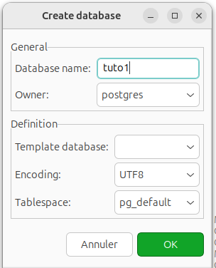
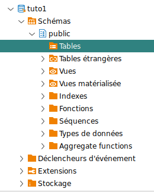
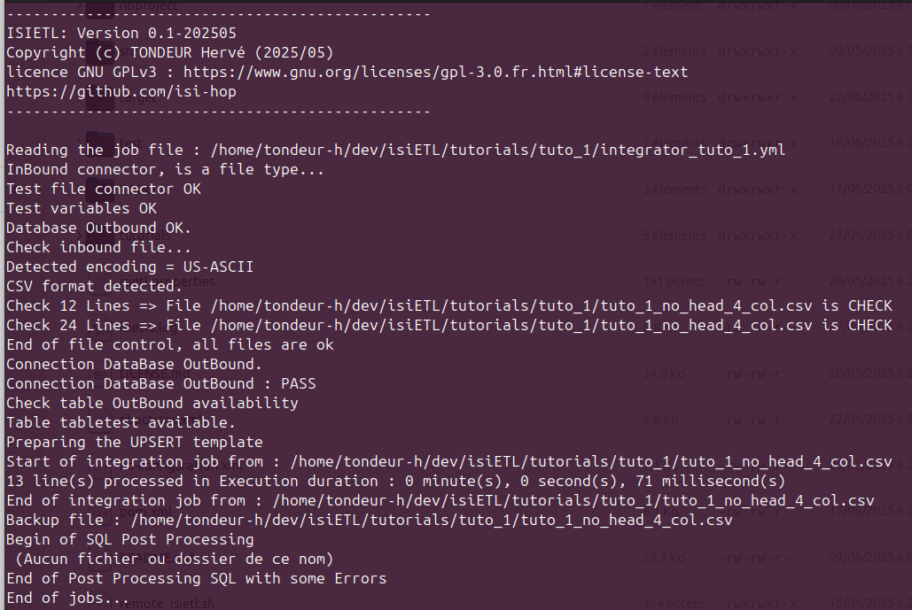
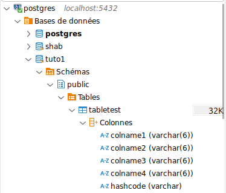
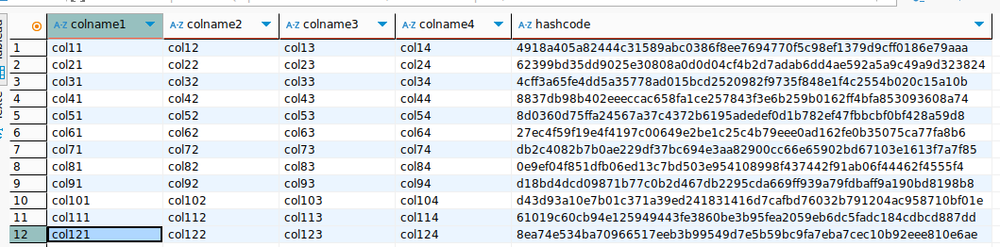

<center><h2>IsiETL TUTORIALS</h2></center>  

**First example** 

We're going to go to the `$ISIETL_HOME/tutorials/tuto_1` folder, which contains the first example of a csv file we're going to integrate into a PosgreSQL database.

This csv file is fairly basic, containing dummy data in 4 columns and 12 rows with no header.

_Extract from file_  
`tuto_1_no_head_4_col.csv`  

> The header line below doesn't exist in the source file, but is here to help you understand the flow of this first tutorial.  

|C1|C2|C3|C4|
|-----|-----|-----|-----|
|col11|col12|col13|col14|
|col21|col22|col23|col24|
|col31|col32|col33|col34|
|col41|col42|col43|col44|
|col51|col52|col53|col54|
|col61|col62|col63|col64|
|col71|col72|col73|col74|
|col81|col82|col83|col84|
|col91|col92|col93|col94|
|col101|col102|col103|col104|
|col111|col112|col113|col114|
|col121|col122|col123|col124|  

The aim of this tutorial is to automatically integrate the data from columns C1 to C4 into a table we'll call `tabletest`, using the default varchar type for each column, with a maximum length of 6 characters.

**Let's get started!**  

Let's start by creating a job file template.  

on the CLI, run the command 
$> `isietl.sh -jt`.

You'll get the file `ìntegrator_template.yml` in the local folder, rename it `integrator_tuto_1.yml`.  

$> `mv integrator_template.yml integrator_tuto_1.yml`  

> - In what follows, we'll assume that you've installed IsiETL in the `$HOME\isietl` folder. In the files that follow, you'll replace the $HOME path with the absolute path of your personal installation.  
> - We'll also assume that we've launched a postgresql database on the workstation, ideally under docker, see the following link on how to launch a postgresql database under docker .  
> - We'll also assume that when we start postgresql, we'll have created a database named `tuto1`  
> - Finally, to set up your database login and password, you'll need to adapt the following information to your configuration.  

[How to use the docker Postgresql official image](https://www.docker.com/blog/how-to-use-the-postgres-docker-official-image/)  

Edit the `integrator_tuto_1.yml` file with your favorite text file editor, like this : 

``` yaml  
#-------------HEADER---------------
jobName: "tuto_1 integrator process"
jobDescription: "Get data from a CSV file : push a DB postgresql"
jobDateTime: "2025-06-11 07:45"
jobBatchSize: "6"
forceIntermediateCommit: "true"
#----------------------------------------
#------------INBOUND CONNECTOR-----------
connectorInbound:
  connectortype: 
    value: "file"
  filespath: 
    value : "$HOME/dev/isiETL/tutorials/tuto_1"
  checkfiles: 
    value: "true"
  backupdestinationpath:
    value: "$HOME/dev/isiETL/tutorials/backup"
  exttype:
    value: "csv"    
  nbfields:
    value: "4"
  jumpheader:
    value: "0"
#----------------------------------------
#------------OUTBOUND CONNECTOR----------
connectorOutbound: 
  connectortype:
    value: "database"
  dbdriver:
    value: "org.postgresql.Driver"
  dburl:
    value: "jdbc:postgresql://localhost:5432/tuto1"
  dblogin:
    value: "postgres"
  dbpassword:
    value: "admin"
  targetTable:
    value: "tabletest"    
  ignoreErrors: 
    value: "false"
  ignoreDuplicates:
    value: "false"

fieldsOut:
   colname1:
    defaultValue: ""
    size: "6"
    type: "varchar"
  colname2:
    defaultValue: ""
    size: "6"
    type: "varchar"
  colname3:
    defaultValue: ""
    size: "6"
    type: "varchar"
  colname4:
    defaultValue: ""
    size: "6"
    type: "varchar"
#-------------------------------------
#-----------FMT PROCESSING------------
filteringScript: ""
mappingScript: ""
transformerScript: ""
#-------------------------------------

#-----------POSTPROCESSING------------
SQLPostProcessing: ""
#-------------------------------------
```  

**Let's unravel the file above!**  

**_First block of information, the header_**  

``` YAML
#-------------HEADER---------------
jobName: "tuto_1 integrator process"
jobDescription: "Get data from a CSV file : push a DB postgresql"
jobDateTime: "2025-06-11 07:45"
jobBatchSize: "6"
forceIntermediateCommit: "true"
#----------------------------------------
```  

The variables, `jobName, jobDescription, jobDateTime` have no impact on the operation of your job and are variables that will force you to comment on your job.  

On these variables you assign the information you feel is relevant to describe the job.

The `jobBatchSize` variable is imperative and will enable you to adjust the number of lines per processing group written to the database.  

This value must be adjusted according to the potential size of the source file. Sometimes the number of source lines is fixed, sometimes it's quite variable; ideally, this value should be for a fixed number of lines <= the maximum number of lines.  

For large files, you need to choose the number of lines according to your commit requirements, bearing in mind that the more commits there are during processing, the longer the process will take, so 
you need to find the right compromise.  

Be careful, this value must be within the range [1..65535].  

Finding the right value is often a matter of trial and error.  

In our case, we'll set it to 6, which will cause 2 commits on this job, which isn't much.  

If you want 1 commit per integration, in this case you need to set this value to 1.  

Here, it's often a matter of trial and error to find the right value.  
In our case, we're going to set it to 6, which will result in 2 commits on this job, which isn't much.  
If you want 1 commit by integration, then you need to set this value to 1.  

The `forceIntermediateCommit` variable takes the value true or false. A true value will force intermediate commits.  

A false value means no intermediate commits, in other words, a single commit is made in this case at the end of the integration of all lines in batch mode. It's like setting the jobBatchSize value to the number of lines in the source file.  


**_Incoming connector in CSV format_**  

The description block for the incoming connector in our case is quite simple, as we'll be describing a CSV file format.  

Below is the description of this block, noting that the £HOME variable is to be replaced by your complete installation path.  

``` YAML
#------------INBOUND CONNECTOR-----------
connectorInbound:
  connectortype: 
    value: "file"
  filespath: 
    value : "$HOME/dev/isiETL/tutorials/tuto_1"
  checkfiles: 
    value: "true"
  backupdestinationpath:
    value: "$HOME/isiETL/dev/tutorials/backup"
  exttype:
    value: "csv"    
  nbfields:
    value: "4"
  jumpheader:
    value: "0"
#----------------------------------------
```  

An inbound connector of any kind always starts with the `connectorInbound` class.  
Next come the connector's description variables, in this case a CSS file.  

What do you need to consume files?  
- A folder where to find them `filespath`, note that a file is supplied, so it's possible to sequentially consume several files of the same nature (same number of columns, same type of data, in the same order).  
- A destination folder `backupdestinationpath` which will be used to store the files after processing (a backup).  
- An indication of the file type, `exttype` (still csv for now).  
- A `checkfiles` flag, to force the file format to be changed or not.  
- A variable that expects an integer giving the number of columns in the source files, `nbfields`.  
- A number of `jumpheader` jump lines at the beginning of the file, so as not to take the header into account. Here the value is 0, because there no header line in the source file.   

Note that by default, the separator is set to “;”.  


**_Outgoing connector in BDD postgresql format_**  

``` YAML 
#------------OUTBOUND CONNECTOR----------
connectorOutbound: 
  connectortype:
    value: "database"
  dbdriver:
    value: "org.postgresql.Driver"
  dburl:
    value: "jdbc:postgresql://localhost:5432/tuto1"
  dblogin:
    value: "postgres"
  dbpassword:
    value: "admin"
  targetTable:
    value: "tabletest"    
  ignoreErrors: 
    value: "false"
  ignoreDuplicates:
    value: "false"
```  

The description of the outgoing connector allows us to describe the database connector that will receive our data.  

As with all connectors, we begin by describing the class of the connector type via the `connectortype` class variable.  
Currently, only the `database` type is supported.  

The `dbdriver`, `dburl`,`dblogin`,`dbpassword` variables are used to describe the database connection.  
Nothing very complex here, just refer to the official documentation for your database driver.  
Example for PostgresQL: [Jdbc Pgsql Drivers uses](https://jdbc.postgresql.org/documentation/use/)  

LThe database is specified on the URL of your connection. Make sure that this database exists and has been created, otherwise your process will stop with a database error.  

The table name is described in the `targetTable` variable, which may or may not exist. IsiETL is responsible for using or creating this table if necessary.  

The `ignoreErrors` variable takes the value true or false, and can be used either to stop the job on an integration error if the value is false, or to continue the job to completion if the value is false.  

The `ignoreDuplicates` variable, with a value of true or false, allows the integration of identical lines (creation of duplicates) if the value is set to true. If the value is set to false, in this case it does not allow the creation of duplicates, in which case a mechanism is put in place to control potential duplicates.  

**_Destination fields description_**  

Now that we've described the database connection and the table name, let's describe the necessary fields.  

``` YAML  
fieldsOut:
   colname1:
    defaultValue: ""
    size: "6"
    type: "varchar"
  colname2:
    defaultValue: ""
    size: "6"
    type: "varchar"
  colname3:
    defaultValue: ""
    size: "6"
    type: "varchar"
  colname4:
    defaultValue: ""
    size: "6"
    type: "varchar"
```  

Here we need to define the necessary fields, by default 4 source fields, so 4 destination fields, of string type in our case, we'll use the literal name of the field types provided by your database.  

How to describe the destination fields is quite simple:  

- First, define a class of variables called `fieldsOut`.  
- For each field, define a name that must be unique for the destination table. Example `colname1,colname2,colname3,colname4`.  
- For each column name, define a field type: varchar, text, int4, int8, timestamp, etc...  
- For some fields, the field size must also be defined, as for example for the varchar type, so it's necessary to define a size systematically. In the case where size doesn't matter, any value will do.  

**_FMT processing_**  

``` YAML
#-----------FMT PROCESSING------------
filteringScript: ""
mappingScript: ""
transformerScript: ""
#-------------------------------------
```  

The FTM part, for “Filter-Map-Transform”, allows you to define scripts to be executed on each processed data line before integration.  
- **Filter**: Returns a Boolean value (true/false) to indicate whether the data line is to be integrated or not.  
- **Map**: Allows mapping between input and output data. Very useful for concatenations, field reductions, etc...  
- **Transform**: This script allows you to perform operations on data, such as upcase, downcase, calculations, etc...  

These scripts are only executed if defined on these variables; they are independent and can be defined as you wish.  
If a filter is not to be defined, leave the variable empty as in the example above, or here in our tutorial we don't apply any scripts.  

**_POST SQL processing_**

``` YAML
#-----------POSTPROCESSING------------
SQLPostProcessing: ""
#-------------------------------------
```  

the `SQLPostProcessing` variable supports a script in SQL format compatible with the outgoing database.  
If defined, this script is executed at the end of the processing of all the lines in the source file(s).  
Not defined in our tutorial, so we leave this variable empty.  

**_How to run this first example?_**  

First run you postgresqal favorite instance, create a database named `tuto1`.  
  

cas you can see, the table is waiting to be created.  
  

on the CLI, run the command   
$> `isietl.sh -fip ./integrator_tuto_1.yml -dp`  

  

As you can see, the `tabletest` is automatically created with all the described fields in the yaml file.  

  

And you can read all the data in this tables, with an extra fields name hashcode.  

  

=> _And about ?_  
- _Try to replay this file again, what append ?_  
Nothing, the problem have just try to insert data, but all exists and isiEtl have done nothing than check each lines.  
- _What happen if i delete data in my destination database ?_  
You can replay you backup csv file again and get back all your loses data.  
- _Try to delete lines into the source CSV file, and replay again !_
Data in destination database be keep and nothing more happen.  
- _Try to add a new correct line in the source CSV file, and play it again?_
The new will be added to your destination file too, and only this new line!.  

---  
**Second example** 

In this second example, we're going to integrate a file containing data on organizations.

<u>The format of the source CSV file is as follows</u> : 

|field number|field name|field type|field size|example|
|------------|----------|----------|----------|-------|
|1|organizationIdentifier|varchar|20|LightTree|
|2|orgType|varchar|12|OPERATIONS|
|3|location|varchar|120|LT-1|
|4|name|varchar|120|LightTree|
|5|division|int4|4|14887|
|6|sourceLink|varchar|255|http://lighttree.com|  


Our source file will be located in the `$HOME/dev/isiETL/tutorials/tuto_2` folder, it contains 63 lines to integrate and 1 header line and contains 6 fields.  

Our destination will be a postGresQL database called `organization` and a table called `orgv3`.  

A little post-processing will be carried out via the script `$HOME/dev/isiETL/tutorial/tuto_2/delete_14887.scr`, which contains the unique deletion query `delete from orgv3 where division=14887;`.  

these elements will enable us to build the following job file :

``` YAML
#
# Copyright (C) 2025 tondeur-h
#
# This program is free software: you can redistribute it and/or modify
# it under the terms of the GNU General Public License as published by
# the Free Software Foundation, either version 3 of the License, or
# (at your option) any later version.
#
# This program is distributed in the hope that it will be useful,
# but WITHOUT ANY WARRANTY; without even the implied warranty of
# MERCHANTABILITY or FITNESS FOR A PARTICULAR PURPOSE.  See the
# GNU General Public License for more details.
#
# You should have received a copy of the GNU General Public License
# along with this program.  If not, see <http://www.gnu.org/licenses/>.
#
#-------------HEADER---------------
jobName: "Organization integration process"
jobDescription: "Update Organization"
jobDateTime: "2025-06-20 07:45"
jobBatchSize: "20"
forceIntermediateCommit: "true"
#----------------------------------------
#------------INBOUND CONNECTOR-----------
connectorInbound:
  connectortype: 
    value: "file"
  filespath: 
    value : "$HOME/dev/isiETL/tutorials/tuto_2"
  checkfiles: 
    value: "true"
  backupdestinationpath:
    value: "$HOME/dev/isiETL/tutorials/backup"
  exttype:
    value: "csv"    
  nbfields:
    value: "6"
  jumpheader:
    value: "1"
#----------------------------------------
#------------OUTBOUND CONNECTOR----------
connectorOutbound: 
  connectortype:
    value: "database"
  dbdriver:
    value: "org.postgresql.Driver"
  dburl:
    value: "jdbc:postgresql://localhost:5432/organization"
  dblogin:
    value: "postgres"
  dbpassword:
    value: "admin"
  targetTable:
    value: "orgv3"    
  ignoreErrors: 
    value: "false"
  ignoreDuplicates:
    value: "false"
#define ;
#organizationIdentifier;orgType;location;locationIdentifier;name;division;sourceLink
fieldsOut:
   organizationidentifier:
    defaultValue: ""
    size: "20"
    type: "varchar"
  orgtype:
    defaultValue: ""
    size: "12"
    type: "varchar"
  location:
    defaultValue: ""
    size: "120"
    type: "varchar"
  name:
    defaultValue: ""
    size: "120"
    type: "varchar"
  division:
    defaultValue: ""
    size: "1"
    type: "int4"
  sourcelink:
    defaultValue: ""
    size: "255"
    type: "varchar"
#-------------------------------------
#-----------FMT PROCESSING------------
filteringScript: ""
mappingScript: ""
transformerScript: ""
#-------------------------------------

#-----------POSTPROCESSING------------
SQLPostProcessing: "$HOME/dev/isiETL/tutorial/tuto_2/delete_14887.scr"
#-------------------------------------
```  

Named this script as `integrator_tuto_2.yml`  

***_let's play the job now !_***   

on the CLI, run the command   
$> `isietl.sh -fip ./integrator_tuto_2.yml -dp`  


🚧️Under Construction🚧️  

